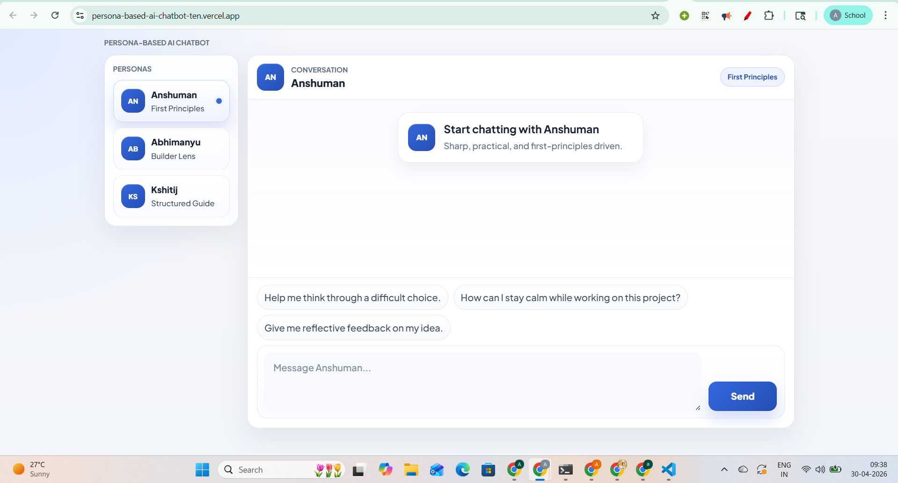
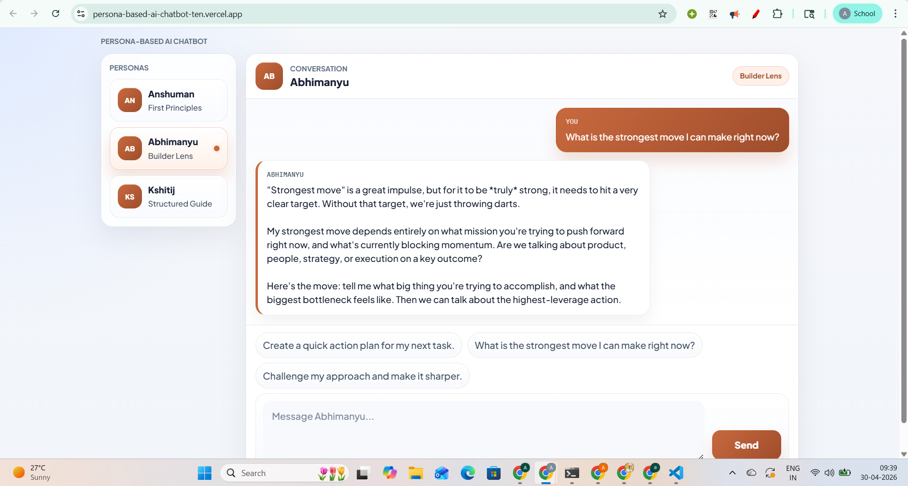
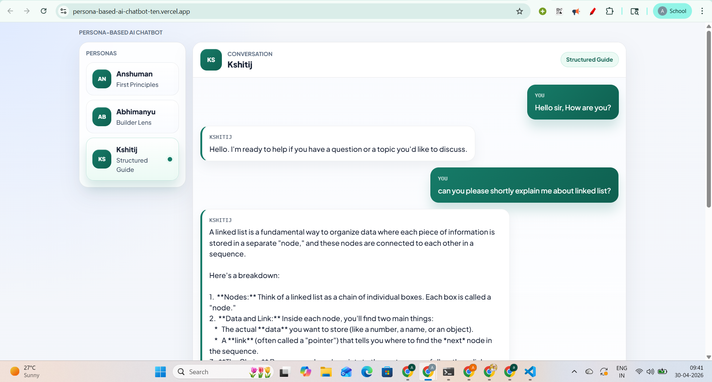

# Persona-Based AI Chatbot

## Overview

Persona-Based AI Chatbot is a full-stack web application built for a persona-driven conversational AI assignment. The project pairs a React + Vite frontend with an Express backend that calls the Gemini API. Users can switch between three distinct personas, send prompts through a shared chat interface, and receive responses shaped by persona-specific backend prompts.

The project is intentionally scoped to focus on prompt design, persona consistency, and clean interaction behavior rather than deployment complexity or extra platform features.

## Features

- Three supported personas: `Anshuman`, `Abhimanyu`, and `Kshitij`
- Persona-specific backend prompts stored in separate files
- Persona switcher with conversation reset behavior
- Chat-style frontend with suggestion chips and typing/loading state
- Express API endpoint for persona-based chat requests
- Friendly frontend error handling
- Clean separation between frontend, backend, and prompt assets

## Tech Stack

- Frontend: React 19, Vite
- Backend: Node.js, Express
- AI integration: Google Gemini via `@google/genai`
- Environment management: `dotenv`

## Project Structure

```text
.
|-- client/
|   `-- .env.example
|-- server/
|-- .env.example
|-- prompts.md
|-- reflection.md
`-- README.md
```

## Setup

### Prerequisites

- Node.js 20 or later
- npm
- A valid Gemini API key

### Frontend Setup

```bash
cd client
npm install
```

### Backend Setup

```bash
cd server
npm install
```

## Environment Variables

Create a `.env` file inside `server/` and define the following variables:

```env
GEMINI_API_KEY=your_key_here
CLIENT_ORIGIN=http://localhost:5173
```

Notes:

- The Gemini API key should exist only in `server/.env`.
- `.env.example` is included as the backend reference template.
- `client/.env.example` is included for optional frontend deployment configuration.
- Real API keys are not committed to the repository.

Optional frontend environment variable:

```env
VITE_API_BASE_URL=
```

- Leave `VITE_API_BASE_URL` empty for local development so the Vite `/api` proxy continues to work.
- Set `VITE_API_BASE_URL` in production when the frontend and backend are deployed on different domains.

## Run Locally

### Start the Backend

```bash
cd server
npm run dev
```

The backend runs on `http://127.0.0.1:5000` by default.

### Start the Frontend

```bash
cd client
npm run dev
```

The frontend runs on `http://127.0.0.1:5173` by default and proxies `/api` requests to the backend.

## Deployment

### Frontend on Vercel

1. Import the `client/` directory as a Vercel project.
2. Use the default Vite build settings:
   - Build command: `npm run build`
   - Output directory: `dist`
3. Set `VITE_API_BASE_URL` only if your backend is deployed on a separate domain.
4. Redeploy after adding or changing environment variables.

### Backend on Render or Railway

1. Deploy the `server/` directory as a Node service.
2. Use:
   - Build command: `npm install`
   - Start command: `npm start`
3. Add the required environment variables:
   - `GEMINI_API_KEY`
   - `PORT` (usually provided automatically by the platform)
   - `CLIENT_ORIGIN` set to your deployed frontend URL
4. After deployment, copy the backend public URL into the frontend `VITE_API_BASE_URL` if the frontend is hosted separately.

## API Notes

The backend currently exposes:

- `GET /api/health`
- `GET /api/personas`
- `POST /api/chat`

The frontend uses the existing `/api/chat` flow and sends persona-specific user input without exposing prompt text or API keys in the browser.

## Prompt and Reflection Documents

- `prompts.md` documents the final persona prompts and the reasoning behind their design.
- `reflection.md` captures a short project reflection covering what worked, what the GIGO principle taught, and what could be improved next.

## Deployed Link

- Deployed app: `https://persona-based-ai-chatbot-ten.vercel.app/`
- Backend API: `https://persona-based-ai-chatbot-t0hw.onrender.com`

## Screenshots

### Home / chat interface


### Persona switching view


### Example conversation


## Notes for Evaluation

- Persona logic is handled on the backend through separate prompt files.
- The frontend is designed to make persona selection and switching behavior visible and testable.
- Prompt design, few-shot examples, and persona consistency are core parts of the project scope.
